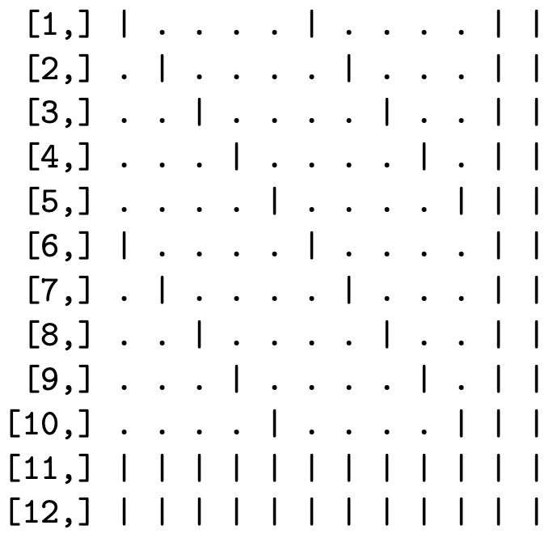

The "standard" way to work with multivariate normal (MVN) random variables in R  (randomly sampling them, or computing their densities) is to use the **mvtnorm** package [@R_mvtnorm].  Its  dmvnorm and rmvnorm functions are very easy to use, requiring the user to provide only the mean vector and symmetric, positive definite covariance matrix.  And if the dimension of the MVN random variable is not too large, and/or these functions are not being called very often, they're great.

But this computation does not come for free.  To use dmvnorm() and rmvnorm() to compute/simulate an M-dimensional MVN sample, the user has to provide the $M\times M$ covariance matrix as a "dense" base R matrix with $M^2$ elements.  When $M$ is very large, the following happens.

1.  Because a covariance matrix is symmetric, there are at most only $\binom{M+1}{2}$ distinct elements, so the base R matrix contains redundant information.
2. The computational algorithms "under the hood" do not scale well as $M$ grows.  The complexity of a dense Cholesky factorization grows *cubically* with $M$ ($\mathcal{O}\!\left(M^3\right)$, while computation for  multiplying triangular dense  matrices and solving dense triangular systems grow quadratically ($\mathcal{O}\!\left(M^2\right)$.
3.  Every call to dmvnorm() or rmvnorm()  involves a factorization of the covariance matrix, even if the matrix does not change from call to call.  Repeating the same expensive step over and over is not very efficient.
4. If the user is starting with a *precision* matrix instead (which would be common when, say, taking a Laplace approximation at the maximum likelihood estimate), the user would have to invert that matrix to get the covariance, which itself can be a computationally intensive step with large problems.

MVN functions in other packages, such as **MASS** [@R_MASS] and **LaplacesDemon** [@R_LaplacesDemon], face similar limitations.[^2] Thus, existing tools for working with the MVN distribution in R are not practical for high-dimensional MVN random variables.

However, for many applications, the covariance or precision matrix is sparse, meaning that the proportion of nonzero elements is small, relative to the total size of the matrix. The `dmvn.sparse()`  and `rmvn.sparse()` functions in the **sparseMVN** package exploit that sparsity to reduce memory requirements, and to gain computational efficiencies, at the cost of a little extra set-up effort.  Instead of requiring the user to supply a dense covariance matrix, `rmvn.sparse()` and `dmvn.sparse()` accept a pre-computed Cholesky decomposition of either the covariance or precision matrix in a compressed sparse format. This approach has several advantages:

1.  Memory requirements are smaller because sparse matrix formats "compress out" the known zeros, leaving only the nonzero elements (and pointers to their locations) to be stored explicitly.

2.  Linear algebra algorithms that are optimzed for sparse matrices are more efficient because they avoid operations on matrix elements that are known to be zero.

3.  When the precision matrix is initially available, there is no need to invert it into a covariance matrix explicitly.

4.  The user computes the Cholesky factor of the matrix separately, just once, before the first  function call, and is not repeated with subsequent calls (as long as the matrix does not change).

The functions in **sparseMVN** rely on sparse matrix classes and functions defined in the **Matrix** package [@R_Matrix], which is a mature  *recommended* package included in all R distributions.  The user creates the covariance or precision matrix as a sparse, symmetric *dsCMatrix* matrix, and computes the sparse Cholesky factor using the `Cholesky`  function. Other than ensuring that the factor for the covariance or precision matrix is in the correct format, the functions behave in much the same way as the corresponding **mvtnorm**  functions.  The efficiency gains in come from storing the covariance or precision matrix in a compressed format without explicit zeros, and applying linear algebra routines that are optimized for those sparse matrix structures.

## MVN density computation and random number generation {#sec:algorithms}

Let $x\in\mathbb{R}^{M}$ be a realization of random variable $X\sim\mathbf{MVN}\!\left(\mu,\Sigma\right)$, where $\mu\in\mathbb{R}^{M}$ is a vector, $\Sigma\in\mathbb{R}^{M\times M}$ is a positive-definite covariance matrix, and $\Sigma^{-1}\in\mathbb{R}^{M\times M}$ is a positive-definite precision matrix.

The log probability density of $x$ is

$$\begin{aligned}
\log f(x)&=-\frac{1}{2}\left(M \log (2\pi) + \log|\Sigma|
  +z^\top z\right),\quad\text{where}~z^\top z=\left(x-\mu\right)^\top\Sigma^{-1}\left(x-\mu\right)
 \end{aligned}$$

The two computationally intensive steps in evaluating $\log f(x)$ are computing $\log|\Sigma|$, and $z^\top z$, *without* explicitly inverting $\Sigma$ or repeating mathematical operations. How one performs these steps *efficiently* in practice depends on whether the covariance matrix $\Sigma$, or the precision matrix $\Sigma^{-1}$ is available. For both cases, we start by finding a lower triangular matrix root: $\Sigma=LL^\top$ or $\Sigma^{-1}=\Lambda\Lambda^\top$. Since $\Sigma$ and $\Sigma^{-1}$ are positive definite, we will use the Cholesky decomposition, which is the unique matrix root with all positive elements on the diagonal.

With the Cholesky decomposition in hand, we compute the log determinant
of $\Sigma$ by adding the logs of the diagonal elements of the factors.
$$\begin{aligned}
  \label{eq:logDet}
  \log|\Sigma|= \begin{cases}
    \phantom{-}2\sum_{m=1}^M\log L_{mm}&\text{ when $\Sigma$ is given}\\
    -2\sum_{m=1}^M\log \Lambda_{mm}&\text{ when $\Sigma^{-1}$ is given}
    \end{cases}\end{aligned}$$

Having already computed the triangular matrix roots also speeds up the computation of $z^\top z$. If $\Sigma^{-1}$ is given, $z=\Lambda^\top(x-\mu)$ can be computed efficiently as the product of an upper triangular matrix and a vector. When $\Sigma$ is given, we find $z$ by solving the lower triangular system $Lz=x-\mu$. The subsequent $z^\top z$ computation is trivially fast.

The algorithm for simulating $X\sim\mathbf{MVN}\!\left(\mu,\Sigma\right)$ also depends on whether $\Sigma$ or $\Sigma^{-1}$ is given. As above, we start by computing the Cholesky decomposition of the given covariance or precision matrix.  Define a random variable $Z\sim\mathbf{MVN}\!\left(0,I_M\right)$, and generate a realization $z$ as a vector of $M$ samples from a standard normal distribution. If $\Sigma$ is given, then evaluate $x=Lz+\mu$. If $\Sigma^{-1}$ is given, then solve for $x$ in the triangular linear system $\Lambda^\top\left(x-\mu\right)=z$. The resulting $x$ is a sample from $\mathbf{MVN}\!\left(\mu,\Sigma\right)$. We confirm the mean and covariance of $X$ as follows: $$\begin{aligned}
 \mathbf{E}\!\left(X\right)&=\mathbf{E}\!\left(LZ+\mu\right)=\mathbf{E}\!\left(\Lambda^\top Z+\mu\right)=\mu\\
   \mathbf{cov}\!\left(X\right)&= \mathbf{cov}\!\left(LZ+\mu\right)=\mathbf{E}\!\left(LZZ^\top L^\top\right)=LL^\top=\Sigma\\
     \mathbf{cov}\!\left(X\right)&=\mathbf{cov}\!\left(\Lambda^{\top^{-1}}Z+\mu\right)=\mathbf{E}\!\left(\Lambda^{\top^{-1}}ZZ^\top\Lambda^{-1}\right)
     =\Lambda^{\top^{-1}}\Lambda^{-1}=(\Lambda\Lambda^\top)^{-1}=\Sigma
 \end{aligned}$$

These algorithms apply when the covariance/precision matrix is either sparse or dense. When the matrix is dense, the computational complexity is $\mathcal{O}\!\left(M^3\right)$ for a Cholesky decomposition, and $\mathcal{O}\!\left(M^2\right)$ for either solving the triangular linear system or multiplying a triangular matrix by another matrix [@GolubVanLoan1996]. Thus, the computational cost grows cubically with $M$ before the decomposition step, and quadratically if the decomposition has already been completed. Additionally, the storage requirement for $\Sigma$ (or $\Sigma^{-1}$) grows quadratically with $M$.

## Sparse matrices in R {#sec:sparse}

The **Matrix** package [@R_Matrix] defines various classes for storing sparse matrices in compressed formats. The most important class for our purposes is *dsCMatrix*, which defines a symmetric matrix, with numeric (double precision) elements, in a column-compressed format. Three vectors define the underlying matrix: the unique nonzero values (just one triangle is needed), the indices in the value vector for the first value in each column, and the indices of the rows in which each value is located. The storage requirements for a sparse $M\times M$ symmetric matrix with $V$ unique nonzero elements in one triangle are for $V$ double precision numbers, $V+M+1$ integers, and some metadata. In contrast, a dense representation of the same matrix stores $M^2$ double precision values, regardless of symmetry and the number of zeros. If $V$ grows more slowly than $M^2$, the matrix becomes increasingly sparse (a smaller percentage of elements are nonzero), with greater efficiency gains from storing the matrix in a compressed sparse format.

### An example

To illustrate how sparse matrices require less memory resources when compressed than when stored densely, consider the following example, which borrows heavily from the vignette of the **sparseHessianFD** package [@R_sparseHessianFD].

Suppose we have a dataset of $N$ households, each with $T$ opportunities to purchase a particular product. Let $y_i$ be the number of times household $i$ purchases the product, out of the $T$ purchase opportunities, and let $p_i$ be the probability of purchase. The heterogeneous parameter $p_i$ is the same for all $T$ opportunities, so $y_i$ is a binomial random variable.

Let $\beta_i\in\mathbb{R}^{k}$ be a heterogeneous coefficient vector that is specific to household $i$, such that $\beta_i=(\beta_{i1},\dotsc,\beta_{ik})$. Similarly, $w_i\in\mathbb{R}^{k}$ is a vector of household-specific covariates.  Define each $p_i$ such that the log odds of $p_i$ is a linear function of $\beta_i$ and $w_i$, but does not depend directly on $\beta_j$ and $w_j$ for another household $j\neq i$. $$\begin{aligned}
  p_i=\frac{\exp(w_i'\beta_i)}{1+\exp(w_i'\beta_i)},~i=1 ... N\end{aligned}$$

The coefficient vectors $\beta_i$ are distributed across the population of households following a MVN distribution with mean $\mu\in\mathbb{R}^{k}$ and covariance $\mathbf{A}\in\mathbb{R}^{k\times k}$. Assume that we know $\mathbf{A}$, but not $\mu$, so we place a multivariate normal prior on $\mu$, with mean $0$ and covariance $\mathbf{\Omega}\in\mathbb{R}^{k\times k}$.  Thus, the parameter vector $x\in\mathbb{R}^{(N+1)k}$ consists of the $Nk$ elements in the $N$ $\beta_i$ vectors, and the $k$ elements in $\mu$.

The log posterior density, ignoring any normalization constants, is

$$\begin{aligned}
  \label{eq:LPD}
  \log \pi(\beta_{1:N},\mu|\mathbf{Y}, \mathbf{W}, \mathbf{A},\mathbf{\Omega})=\sum_{i=1}^N\left(p_i^{y_i}(1-p_i)^{T-y_i}
  -\frac{1}{2}\left(\beta_i-\mu\right)^\top\mathbf{A}^{-1}\left(\beta_i-\mu\right)\right)
-\frac{1}{2}\mu^\top\mathbf{\Omega}^{-1}\mu\end{aligned}$$

Because one element of $\beta_i$ can be correlated with another element of $\beta_i$ (for the same unit), we allow for the cross-partials between elements of $\beta_i$ for any $i$ to be nonzero. Also, because the mean of each $\beta_i$ depends on $\mu$, the cross-partials between $\mu$ and any $\beta_i$ can be nonzero. However, since the $\beta_i$ and $\beta_j$ are independent samples, and the $y_i$ are conditionally independent, the cross-partial derivatives between an element of $\beta_i$ and any element of any $\beta_j$ for $j\neq i$, must be zero.  When $N$ is much greater than $k$, there will be many more zero cross-partial derivatives than nonzero, and the Hessian of the log posterior density will be sparse.

The sparsity pattern depends on how the variables are ordered. One such ordering is to group all of the coefficients in the $\beta_i$ for each unit together, and place $\mu$ at the end.

$$\begin{aligned}
\beta_{11},\dotsc,\beta_{1k},\beta_{21},\dotsc,\beta_{2k},~\dotsc~,\beta_{N1},\dotsc,\beta_{Nk},\mu_1,\dotsc,\mu_k\end{aligned}$$

In this case, the Hessian has a "block-arrow" pattern. Figure [\[fig(#fig:blockarrow){reference-type="ref" reference="fig:blockarrow"} illustrates this pattern for $N=5$ and $k=2$ (12 total variables).

Another possibility is to group coefficients for each covariate together.

$$\begin{aligned} \beta_{11},\dotsc,\beta_{N1},\beta_{12},\dotsc,\beta_{N2},~\dotsc~,\beta_{1k},\dotsc,\beta_{Nk},\mu_1,\dotsc,\mu_k\end{aligned}$$

Now the Hessian has an \"banded\" sparsity pattern, as in Figure (#fig:banded).

{width=40\%} {width=40\%}

In both cases, the number of nonzeros is the same. There are 144 elements in this symmetric matrix. If the matrix is stored in the standard dense format, memory is reserved for all 144 values, even though only 64 values are nonzero, and only 38 values are unique. For larger matrices, the reduction in memory requirements by storing the matrix in a sparse format can be substantial.[^3]. If $N=$`<!-- -->`{=html}1,000, then $M=$`<!-- -->`{=html}2,002, with more than $4$ million elements in the Hessian. However, only 12,004 of those elements are nonzero, with 7,003 unique values in the lower triangle.  The dense matrix requires 30.6 Mb of RAM, while a sparse symmetric matrix of the *dsCMatrix* class requires only 91.6 Kb.

This example is relevant because, when evaluated at the posterior mode, the Hessian matrix of the log posterior is the MVN precision matrix $\Sigma^{-1}$ of a MVN approximatation to the posterior distribution of $\left(\beta_{1:N},\mu\right)$. If we were to simulate from this MVN using , or evaluate MVN densities using , we would need to invert $\Sigma^{-1}$ to $\Sigma$ first, and store it as a dense matrix.  Internally, and invoke dense linear algebra routines, including matrix factorization.

<!-- The package calls sparse linear algebra routines that are implemented in the **CHOLMOD** library [@ChenDavis2008; @DavisHager1999; @DavisHager2009]. -->

<!-- Internally, **sparseMVN** uses standard methods of computing the MVN density and simulating MVN random variables (see Section [1.1](#sec:algorithms){reference-type="ref" reference="sec:algorithms"}). Since a large proportion of elements in the matrix are zero, we need to store only the row and column indices, and the values, of the unique nonzero elements. -->
<!-- Of course, -->

# References

<!-- so $x\in\mathbb{R}^{M}$ is a realization of random variable $X\sim\mathbf{MVN}\!\left(\mu,\Sigma\right)$. These functions require the user to supply a full covariance matrix $\Sigma\in\mathbb{R}^{M\times M}$ as a base R matrix object.  The $\Sigma$ matrix is "dense" in the sense that all $M^2$ elements are stored, even though in a symmetric matrix, at most only $\binom{M+1}{2}$ of those numbers are distinct.  Internally, both rmvnorm() and dmvnorm() factor the covariance matrix using a Cholesky decomposition, whose complexity is $\mathcal{O}\!\left(M^3\right)$[@GolubVanLoan1996].[^1] This factorization is performed every time the function is called, even if the covariance matrix does not change from call to call. And then, once the covariance is factored, we still need to either multiply a triangular matrix, and solve a triangular linear system, both of which are $\mathcal{O}\!\left(M^2\right)$ [@GolubVanLoan1996] on dense matrices. Also, if the user is starting with a precision matrix $\Sigma^{-1}$, that must be inverted explicitly.
-->
