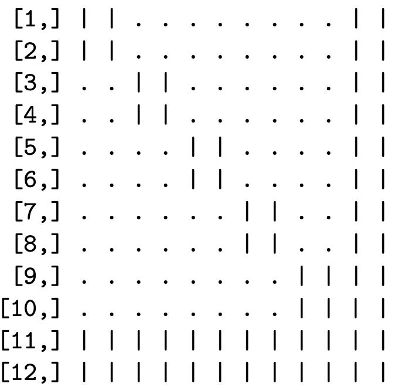
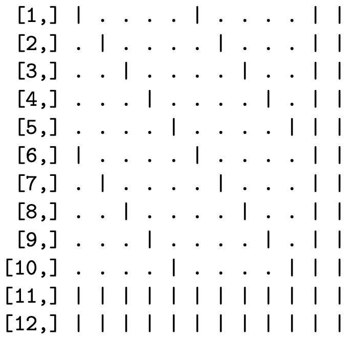

## Sparse matrices in R {#sec:sparse}

The [Matrix](https://cran.r-project.org/package=Matrix) package defines various classes for storing sparse matrices in compressed formats. The most important class for our purposes is `dsCMatrix`, which defines a symmetric matrix, with numeric (double precision) elements, in a column-compressed format. Three vectors define the underlying matrix: the unique nonzero values (just one triangle is needed), the indices in the value vector for the first value in each column, and the indices of the rows in which each value is located. The storage requirements for a sparse $M\times M$ symmetric matrix with $V$ unique nonzero elements in one triangle are for $V$ double precision numbers, $V+M+1$ integers, and some metadata. In contrast, a dense representation of the same matrix stores $M^2$ double precision values, regardless of symmetry and the number of zeros. If $V$ grows more slowly than $M^2$, the matrix becomes increasingly sparse (a smaller percentage of elements are nonzero), with greater efficiency gains from storing the matrix in a compressed sparse format.

### An example

To illustrate how sparse matrices require less memory resources when compressed than when stored densely, consider the following example, which borrows heavily from the vignette of the [sparseHessianFD](braunm.github.io/sparseHessianFD)  package.

Suppose we have a dataset of $N$ households, each with $T$ opportunities to purchase a particular product. Let $y_i$ be the number of times household $i$ purchases the product, out of the $T$ purchase opportunities, and let $p_i$ be the probability of purchase. The heterogeneous parameter $p_i$ is the same for all $T$ opportunities, so $y_i$ is a binomial random variable.

Let $\beta_i\in\mathbb{R}^{k}$ be a heterogeneous coefficient vector that is specific to household $i$, such that $\beta_i=(\beta_{i1},\dotsc,\beta_{ik})$. Similarly, $w_i\in\mathbb{R}^{k}$ is a vector of household-specific covariates.  Define each $p_i$ such that the log odds of $p_i$ is a linear function of $\beta_i$ and $w_i$, but does not depend directly on $\beta_j$ and $w_j$ for another household $j\neq i$. $$\begin{aligned}
  p_i=\frac{\exp(w_i'\beta_i)}{1+\exp(w_i'\beta_i)},~i=1 ... N\end{aligned}$$

The coefficient vectors $\beta_i$ are distributed across the population of households following a MVN distribution with mean $\mu\in\mathbb{R}^{k}$ and covariance $\mathbf{A}\in\mathbb{R}^{k\times k}$. Assume that we know $\mathbf{A}$, but not $\mu$, so we place a multivariate normal prior on $\mu$, with mean $0$ and covariance $\mathbf{\Omega}\in\mathbb{R}^{k\times k}$.  Thus, the parameter vector $x\in\mathbb{R}^{(N+1)k}$ consists of the $Nk$ elements in the $N$ $\beta_i$ vectors, and the $k$ elements in $\mu$.

The log posterior density, ignoring any normalization constants, is

$$\begin{aligned}
  \label{eq:LPD}
  \log \pi(\beta_{1:N},\mu|\mathbf{Y}, \mathbf{W}, \mathbf{A},\mathbf{\Omega})=\sum_{i=1}^N\left(p_i^{y_i}(1-p_i)^{T-y_i}
  -\frac{1}{2}\left(\beta_i-\mu\right)^\top\mathbf{A}^{-1}\left(\beta_i-\mu\right)\right)
-\frac{1}{2}\mu^\top\mathbf{\Omega}^{-1}\mu\end{aligned}$$

Because one element of $\beta_i$ can be correlated with another element of $\beta_i$ (for the same unit), we allow for the cross-partials between elements of $\beta_i$ for any $i$ to be nonzero. Also, because the mean of each $\beta_i$ depends on $\mu$, the cross-partials between $\mu$ and any $\beta_i$ can be nonzero. However, since the $\beta_i$ and $\beta_j$ are independent samples, and the $y_i$ are conditionally independent, the cross-partial derivatives between an element of $\beta_i$ and any element of any $\beta_j$ for $j\neq i$, must be zero.  When $N$ is much greater than $k$, there will be many more zero cross-partial derivatives than nonzero, and the Hessian of the log posterior density will be sparse.

The sparsity pattern depends on how the variables are ordered. One such ordering is to group all of the coefficients in the $\beta_i$ for each unit together, and place $\mu$ at the end.

$$\begin{aligned}
\beta_{11},\dotsc,\beta_{1k},\beta_{21},\dotsc,\beta_{2k},~\dotsc~,\beta_{N1},\dotsc,\beta_{Nk},\mu_1,\dotsc,\mu_k\end{aligned}$$

In this case, the Hessian has a "block-arrow" pattern. Figure [\[fig(#fig:blockarrow){reference-type="ref" reference="fig:blockarrow"} illustrates this pattern for $N=5$ and $k=2$ (12 total variables).

Another possibility is to group coefficients for each covariate together.

$$\begin{aligned} \beta_{11},\dotsc,\beta_{N1},\beta_{12},\dotsc,\beta_{N2},~\dotsc~,\beta_{1k},\dotsc,\beta_{Nk},\mu_1,\dotsc,\mu_k\end{aligned}$$

Now the Hessian has an \"banded\" sparsity pattern, as in Figure (#fig:banded).

{width=40\%} {width=40\%}

In both cases, the number of nonzeros is the same. There are 144 elements in this symmetric matrix. If the matrix is stored in the standard dense format, memory is reserved for all 144 values, even though only 64 values are nonzero, and only 38 values are unique. For larger matrices, the reduction in memory requirements by storing the matrix in a sparse format can be substantial.[^3]. If $N=$`<!-- -->`{=html}1,000, then $M=$`<!-- -->`{=html}2,002, with more than $4$ million elements in the Hessian. However, only 12,004 of those elements are nonzero, with 7,003 unique values in the lower triangle.  The dense matrix requires 30.6 Mb of RAM, while a sparse symmetric matrix of the *dsCMatrix* class requires only 91.6 Kb.

This example is relevant because, when evaluated at the posterior mode, the Hessian matrix of the log posterior is the MVN precision matrix $\Sigma^{-1}$ of a MVN approximatation to the posterior distribution of $\left(\beta_{1:N},\mu\right)$. If we were to simulate from this MVN using , or evaluate MVN densities using , we would need to invert $\Sigma^{-1}$ to $\Sigma$ first, and store it as a dense matrix.  Internally, and invoke dense linear algebra routines, including matrix factorization.
